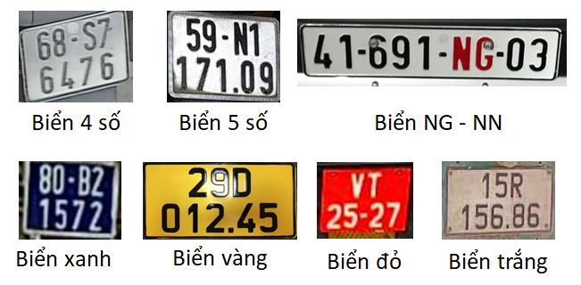

# VietANPR - thư viện đọc biển số xe máy & xe hơi

Vietnamese Automatic Number Plate Recognition SDK (ANPR) dành cho hệ thống cần nhận diện biển số tự động.

## Tính năng
- Đọc biển số xe máy 4 số và 5 số
- Đọc biển số xe hơi vuông và dài (long & short)
- Đọc được biển số theo Thông tư 58 Bộ Công An
- Đọc được biển số từ camera hồng ngoại
- Đọc được một số biển số khó (nhòe, mờ,... ở mức độ chấp nhận được)



## Một số ví dụ


## Download chương trình demo
Để test độ chính xác của phần mềm quý khách có thể chạy chương trình build sẵn (.exe) tại link cuối bài:
https://viscomsolution.com/vietanpr-phan-mem-nhan-dien-bien-so-xe/


Quý khách cần cài đặt:
- [Microsoft .NET Framework 4.7.2](https://dotnet.microsoft.com/en-us/download/dotnet-framework/net472)
- [C++ Redistributable 2022 x64](https://aka.ms/vs/17/release/vc_redist.x64.exe)

Ưu điểm và tính năng của VietANPR:

- Hoạt động offline, không cần internet
- Không cần GPU
- Tốc độ nhanh
- Nhận diện nhiều biển số cùng lúc


## Build source code example (SDK)

Để hiểu cách tích hợp thư viện vào phần mềm cổng kiểm soát bãi xe chúng tôi có kèm theo source code example cách gọi hàm.

Thông tin về source code example:
- Viết bằng ngôn ngữ C# và VB.NET
- Chỉ có 1 phiên bản x64
- Build bằng **Visual Studio 2022** trở lên
- Chỉ chạy trên **Windows 10 x64** (Không hỗ trợ Windows 7, Windows 10 x86)
	
	
## Thông tin liên hệ & mua license key
	
Võ Hùng Vĩ

Phone/zalo: 0939825125

# Hướng dẫn tích hợp VietANPR-SDK


## Khởi tạo

```cs
using TGMT;

void main()
{
   PlateReader reader = new PlateReader();
}
```
| Thuộc tính | Kiểu | Giải thích
|---|---|---|
| `reader.IsLicense` | `bool` | Trả về **true** nếu đã mua license
| `reader.DrawRectangle` | `bool` | Set **true** để vẽ vị trí biển số
| `reader.CropPlate` | `bool` | Set **true** để crop biển số |
| `reader.Version` | `bool` | Version của thư viện |

---

## Hàm Read()

Công dụng: đọc 1 biển số trong ảnh, tham số là đường dẫn ảnh hoặc Bitmap. Sử dụng hàm này nếu bạn biết trong ảnh chỉ có 1 biển số, VD bãi xe.

**VD đọc biển số từ đường dẫn ảnh**
```cs
string imagePath = "D:\\example.jpg";
VehiclePlate plate = reader.Read(imagePath);
```

**VD đọc biển số từ bitmap**
```cs
Bitmap bmp = new Bitmap("D:\\example.jpg");
VehiclePlate plate = reader.Read(bmp);
```

## Hàm Reads()

Công dụng: đọc nhiều biển số trong 1 ảnh, tham số là đường dẫn ảnh hoặc Bitmap

**VD đọc biển số từ đường dẫn ảnh**
```cs
string imagePath = "D:\\example.jpg";
VehiclePlate[] plates = reader.Reads(imagePath);
```

**VD đọc biển số từ bitmap**
```cs
Bitmap bmp = new Bitmap("D:\\example.jpg");
VehiclePlate[] plates = reader.Reads(bmp);
```

## Các thuộc tính của kết quả VehiclePlate

| Thuộc tính | Kiểu | Giải thích | Ví dụ
|---|---|---|---|
| `text` | `string` | Ký tự biển số đầy đủ | 51H-123.45
| `alphanumeric` | `string` | Biển số chỉ có ký tự từ A-Z và số | 51H12345
| `bitmap` | `Bitmap` | Ảnh biển số đã crop hoặc vẽ vị trí biển số lên ảnh |
| `rect` | `Rectangle` | Vị trí biển số trong ảnh, luôn nằm ngang |
| `isValid` | `bool` | **true** nếu ký tự kết quả nhận diện hợp lệ |
| `error` | `string` | Nội dung lỗi (nếu có)|
| `elapsedMilisecond` | `long` | Thời gian xử lý |
| `score` | `float` | Độ tự tin về ký tự nhận diện được |
| `top_left` | `Point` | Góc trên trái |
| `top_right` | `Point` | Góc trên phải |
| `bottom_right` | `Point` | Góc dưới phải |
| `bottom_left` | `Point` | Góc dưới trái |
| `type` | `PlateType` | Loại biển số | **Unknown**: Không xác định, **Long:** Biển dài 1 hàng, **Short:** Biển vuông 2 hàng

---
## Thông tin liên hệ & hỗ trợ kỹ thuật
	
Võ Hùng Vĩ

Phone/zalo: 0939825125